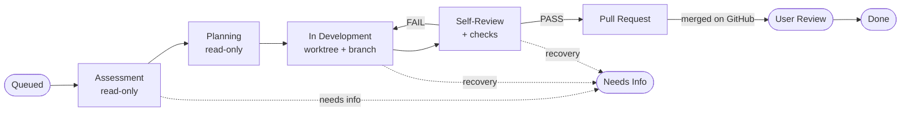

# Docket

**From ask to merge — in the open.**

[](https://github.com/thenofisamizdat/docket/actions/workflows/ci.yml)
[](LICENSE)
[](https://www.python.org/downloads/)

Docket is a **portable ticket pipeline and autonomous development agent** you install
into any git repository. Stakeholders file a ticket in plain language; Docket assesses
it against your codebase, drafts a plan, implements it on an isolated branch,
reviews its own work, and opens a pull request — recording every step on a live
ticket timeline so the work is auditable from request to merge.

It is designed for one thing above all: **dependability**. Docket does not silently
stall when something goes wrong. It classifies *why* a ticket failed and takes the
right corrective action — retry, escalate, ask the requester a specific question, or
flag a genuine blocker — so the queue keeps moving without a human babysitting it.

---

## Table of contents

- [Why Docket](#why-docket)
- [How it works](#how-it-works)
- [Reliability model](#reliability-model)
- [Features](#features)
- [Architecture](#architecture)
- [Requirements](#requirements)
- [Quickstart](#quickstart)
- [CLI reference](#cli-reference)
- [Configuration](#configuration)
- [Running in production](#running-in-production)
- [Security & credentials](#security--credentials)
- [Data & storage](#data--storage)
- [License](#license)

---

## Why Docket

Most "AI coding" tooling assumes a developer is driving. Docket is built for the
opposite case: a queue of requests from testers, PMs, or support — many of them
vague — that need to become reviewed, mergeable changes without a maintainer
hand-holding each one.

- **Plain-language intake.** Anyone can file a ticket. Docket grooms it: clear asks
  proceed; ambiguous high-priority asks are bounced back with a specific question.
- **Everything in the open.** Each phase (assessment, plan, diff, self-review,
  test instructions) is written to the ticket timeline with cost and effort, so a
  reviewer can see exactly what was done and why.
- **Isolated and safe.** Every ticket is implemented in its own git worktree on a
  dedicated branch. The pull request is the human gate — Docket never merges without
  being explicitly told to.
- **It keeps going.** Transient infrastructure errors self-heal; scope failures
  escalate to a stronger model; defects trigger bounded corrective passes. A ticket
  only lands in front of a human when a human is genuinely required.

## How it works

Docket owns the lifecycle; it invokes a headless [Claude Code](https://claude.com/claude-code)
agent **one phase at a time**, supplying repo-aware context and recording the result.



1. **Assessment** *(read-only)* — explores the repo and judges whether the ask is
   clear enough to implement. Vague high-priority tickets are bounced to the
   requester with a concrete question.
2. **Planning** *(read-only)* — produces an ordered, file-level implementation plan.
3. **In Development** — implements the plan in a per-ticket worktree
   (`docket/DKT-<n>` branched off your base branch) and commits with a detailed
   message (Why / What changed / Files / Acceptance criteria).
4. **Self-Review** — reviews its own diff against the acceptance criteria and runs
   any quick checks (compile/lint/tests). On failure it loops back into development
   with the review feedback — a **real, bounded corrective loop**.
5. **Pull Request** — pushes the branch and opens a PR (or records a compare URL if
   no GitHub token is configured). **Never auto-merged unless you opt in.**
6. **Merge reconciliation** — once the PR is merged on GitHub, Docket detects it,
   advances the ticket to *User Review*, and notifies the relevant people.

## Reliability model

Docket's core differentiator is that failures are **diagnosed, not blindly retried.**

| Failure class | Detection | Corrective action |
|---|---|---|
| **Transient / infra** (overload, rate-limit, timeout, network) | error-string + result classifier | retry in-phase with exponential backoff; if it persists, **auto-requeue** (bounded) so the queue keeps moving — never a dead-end stall |
| **Scope** (ran out of turns / budget) | run result subtype | retry once with a **stronger model and doubled limits** — more capability, aimed at the same task |
| **Defect** (self-review fails) | review verdict | bounded **corrective re-implementation** passes, escalating to the strong model |
| **Underspecified ask** | recovery triage | bounce to the **requester** with a specific question (Needs Info), re-entering the pipeline once answered |
| **Genuine blocker** (design decision, external access) | recovery triage | a single, clearly-labelled human-gated stall — with the diagnosis attached |

By default every phase runs on the strongest available model (**Opus**), because
pipeline quality matters more than per-ticket cost. This is configurable.

## Features

- **Autonomous pipeline** — assess → plan → implement → self-review → PR, one
  headless agent phase at a time, fully logged.
- **Reason-driven recovery** — the classifier/router described above; the queue is
  self-healing and never silently stuck.
- **Worktree isolation** — every ticket on its own branch and worktree; no
  cross-contamination, trivial cleanup.
- **GitHub integration** — opens real PRs when a token is present (compare URLs
  otherwise), reconciles merges, and supports **opt-in auto-merge** for a fully
  hands-off ask→merge flow.
- **Codebase recognition** — `docket init` profiles the repo (`.docket/profile.md`),
  generates a `CLAUDE.md` if absent, and seeds starter tickets, so the agent is
  repo-aware from the very first ticket.
- **Self-serve web UI** — a board, ticket timelines, a live "currently working on"
  ticker, and a new-ticket form, served standalone (no external database).
- **Notifications** — email via `msmtp` (PR ready / needs info / stalled / user
  review); gracefully queues if mail isn't configured.
- **Effort & telemetry** — per-ticket time and cost are recorded; touched files and
  API routes are captured as a join key for post-ship health.
- **Portable & config-driven** — no host coupling; install into any git repo and
  run with `docket up`.

## Architecture

A deliberately small, dependency-light package (`docket_dev`):

| Module | Responsibility |
|---|---|
| `agent.py` | The orchestrator: lifecycle transitions, per-phase headless Claude calls, the recovery router, PR/merge automation. |
| `storage.py` | SQLite-backed tickets, events, notifications, and links; the canonical state machine (`TRANSITIONS`). |
| `routes.py` / `app.py` | FastAPI application and JSON API behind the web UI. |
| `web/` | Prebuilt single-page UI (shipped in the wheel — no frontend toolchain needed to install). |
| `config.py` | Loads `.docket/config.toml`; mirrors settings into env for the agent. |
| `recognize.py` | Codebase profiling, `CLAUDE.md` generation, and starter-ticket seeding. |
| `telemetry.py` | Lightweight request/latency capture. |
| `auth.py` | Per-project login + JWT, tester directory. |
| `cli.py` | The `docket` command. |

The agent imports only the storage layer — it is intentionally free of heavy
dependencies (no vector store, no graph DB) so it can run anywhere your repo lives.

## Requirements

- **Python ≥ 3.11**
- The **`claude` CLI**, authenticated and on `PATH` ([Claude Code](https://claude.com/claude-code))
- **`git`**
- *(optional)* **`msmtp`** for email notifications
- *(optional)* a **GitHub token** for real PR objects and auto-merge

## Quickstart

```bash
# Install (isolated, recommended)
pipx install git+https://github.com/thenofisamizdat/docket
# …or from a built wheel:  pipx install ./dist/docket_dev-0.1.0-py3-none-any.whl

# Set it up inside the repo you want it to work on
cd ~/path/to/your/repo
docket init        # detect repo, write .docket/config.toml, init the DB, recognize the codebase

# Run the web UI + agent together
docket up          # open the printed URL, e.g. http://localhost:8011/docket
```

`docket init` auto-detects the GitHub slug, base branch, and a free port; generates a
per-project login and JWT secret; writes everything under `.docket/` (gitignored);
then recognizes the codebase and seeds a handful of starter tickets in the Discussion
zone.

## CLI reference

| Command | Description |
|---|---|
| `docket init [path]` | Detect the repo, write `.docket/config.toml`, init the DB, recognize the codebase, seed tickets. Flags: `--slug`, `--base-branch`, `--port`, `--base-url`, `--user/--email/--password`, `--model`, `--no-writes`, `--no-push`, `--no-recognize`, `--force`. |
| `docket up [--daemon]` | Run the web UI and agent together (foreground; `--daemon` installs systemd units). |
| `docket down` | Stop the background services. |
| `docket serve` | Run just the web UI. |
| `docket agent [--once]` | Run just the agent loop (`--once` works a single ticket then exits). |
| `docket recognize` | Regenerate the repo profile + `CLAUDE.md`. |
| `docket seed` | Draft starter tickets from the repo. |
| `docket status` | Show the current config and ticket status. |

## Configuration

All state lives in the target repo under `.docket/` (config, databases, worktrees,
profile). Edit `.docket/config.toml`:

| Key | Default | Purpose |
|---|---|---|
| `[repo].slug` | *(detected)* | `owner/name` for the GitHub API + compare URLs. |
| `[repo].base_branch` / `remote` | `main` / `origin` | Branch PRs target; remote to push to. |
| `[server].port` / `host` / `base_url` | `8011` / `0.0.0.0` / `http://localhost:8011` | Web server bind + the public URL used in notification links. |
| `[agent].writes` | `true` | Allow code generation. With it off, Docket only grooms (assess + plan). |
| `[agent].push` | `true` | Push the branch. With it off, implement + commit locally and hold for inspection. |
| `[agent].auto_merge` | `false` | Squash-merge the PR via the API once self-review passes (requires a token). |
| `[agent].model` | `opus` | Default model for every phase. |
| `[agent].strong_model` | `opus` | Model the recovery router escalates to (scope/defect). |
| `[agent].github_token` | *(empty)* | Token for real PR objects + merge. Falls back to `DOCKET_GITHUB_TOKEN`. |
| `[agent].poll_secs` / `merge_poll_secs` | `20` / `90` | Queue poll and merge-reconcile intervals. |
| `[auth].testers` | *(generated)* | Login directory (`username`, `name`, `email`, `password`). |
| `[mail].from` | `Docket <docket@localhost>` | Sender identity for `msmtp` notifications. |

Every key is also overridable via a `DOCKET_*` environment variable for ephemeral or
secret-managed deployments.

## Running in production

`docket up --daemon` writes and starts systemd units for the web server and the agent.
Manage them with the standard tooling:

```bash
docket up --daemon                 # install + start the services
systemctl status docket-*          # health
docket down                        # stop
```

The agent and web server are independent processes; the agent can run on a schedule or
continuously, and survives restarts (in-flight tickets are auto-resumed).

## Security & credentials

- **The agent writes code and runs commands.** Run it as a user that *should* have
  that authority on the target repo — it has the `claude` credentials and the git
  push identity.
- **Pull request is the gate.** Docket never merges unless `auto_merge` is explicitly
  enabled *and* a token is present. Without a token it only ever pushes a branch and
  records a compare URL.
- **Auto-merge + branch protection.** If you enable `auto_merge`, ensure the token's
  account is permitted to merge — branch protection requiring reviews will (correctly)
  block an unreviewed auto-merge.
- **Secrets** belong in the environment (`DOCKET_GITHUB_TOKEN`) or a secret manager,
  not committed to `config.toml`.

## Data & storage

Everything Docket creates is scoped to the target repo and gitignored:

```
.docket/
├── config.toml         # configuration
├── data/
│   ├── docket.db        # tickets, events, notifications, links
│   └── telemetry.db     # request/latency capture
├── worktrees/           # per-ticket git worktrees
└── profile.md           # generated codebase profile (injected into prompts)
```

## License

Licensed under the **Apache License, Version 2.0** — see [LICENSE](LICENSE) and
[NOTICE](NOTICE).

Copyright © 2026 Neil Byrne.
